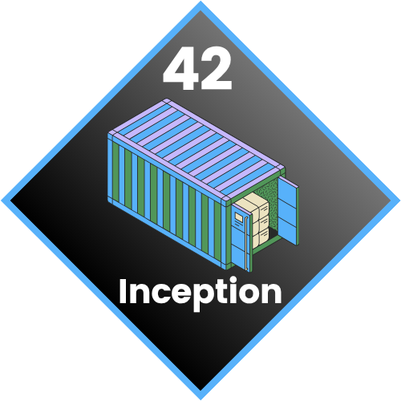

<div align="center">
  
  <h2>42 Inception Project</h2>
    <a href= https://github.com/emre-mr246/42-evaluation></a>
    <a href= https://github.com/emre-mr246/42-evaluation></a>
    <a href= https://github.com/emre-mr246/42-evaluation></a>
    <a href= https://github.com/emre-mr246/42_ring5_inception></a>
    <a href="https://42istanbul.com.tr/"></a>
   
<h4>
    <a href="https://github.com/emre-mr246/42_ring5_inception/issues">❔ Ask a Question</a>
  <span> · </span>
    <a href="https://github.com/emre-mr246/42_ring5_inception/issues">🪲 Report Bug</a>
  <span> · </span>
    <a href="https://github.com/emre-mr246/42_ring5_inception/issues">💬 Request Feature</a>
</h4>
</div>


## Introduction 🚀

This project sets up a multi-container Docker application using Docker Compose. It includes various services like a web server, database, caching, and more, all orchestrated to work together. The primary goal is to learn about Docker, Docker Compose, and system administration.

## Features 🔍

This project includes the following services:

*   **Nginx:** Web server and reverse proxy.
*   **MariaDB:** SQL database server.
*   **WordPress:** Content Management System.
*   **Adminer:** Database management tool.
*   **Redis:** In-memory data structure store, used as a cache.
*   **FTP Server:** For file transfer.
*   **Splunk Forwarder:** Collects logs from other services and sends them to the Splunk Server using Splunk Forwarder.
*   **Static Page:** A simple static website.

## Usage ⚙️

### Prerequisites

*   **Docker Engine**
*   **Docker Swarm mode**
*   **Docker Compose** (not docker-compose)
*   **Make**
*   `srcs/requirements/bonus/log_collector/tools/splunkforwarder.tgz` (must be placed manually)
*   `srcs/env/.env_splunk_forwarder` (must be configured manually)
*   `srcs/env/.env_wordpress` (must be configured manually)

### Build and Run

1.  **Clone the repository (if you haven't already):**
    ```bash
    git clone <repository_url> inception
    cd inception
    ```

2.  **Build the Docker images and start the services:**
    ```bash
    make
    ```
    This command will:
    *   Initialize Docker Swarm if not already active.
    *   Create necessary data directories (`~/data/*`).
    *   Create a Docker network named `inception_network`.
    *   Generate SSL certificates.
    *   Create Docker Swarm secrets for secure credential management.
    *   Build all Docker images for the services.
    *   Create Docker volumes for persistent data.
    *   Fix permissions for data directories.
    *   Deploy the stack using `docker-compose.yml`.
    *   Display the status of the services and IP information to access the site.

3.  **Access the website:**
    ```bash
    firefox https://emgul.42.fr/static
    ```